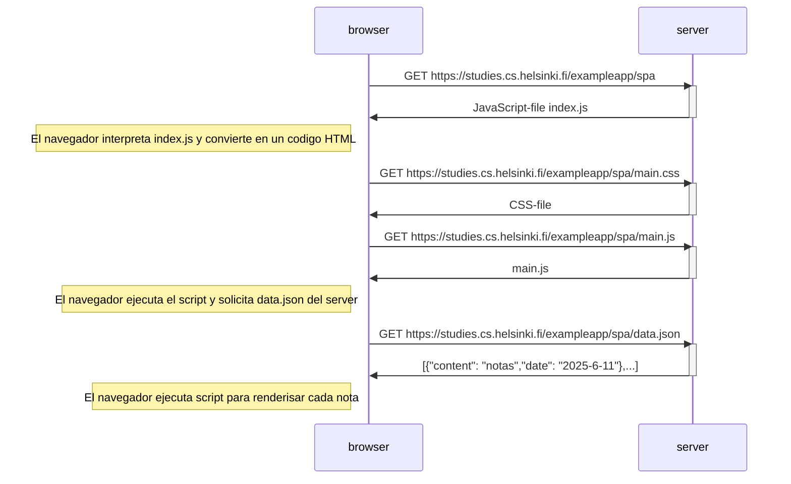

```mermaid
sequenceDiagram
  participant browser
  participant server

  browser->>server: GET https://studies.cs.helsinki.fi/exampleapp/spa
  activate server
  server->>browser: JavaScript-file index.js
  deactivate server

  Note left of browser: El navegador interpreta index.js y convierte en un codigo HTML

  browser->>server: GET https://studies.cs.helsinki.fi/exampleapp/spa/main.css
  activate server
  server->>browser: CSS-file
  deactivate server

  browser->>server: GET https://studies.cs.helsinki.fi/exampleapp/spa/main.js
  activate server
  server->>browser: main.js
  deactivate server

  Note left of browser: El navegador ejecuta el script y solicita data.json del server

  browser->>server: GET https://studies.cs.helsinki.fi/exampleapp/spa/data.json
  activate server
  server->>browser: [{"content": "notas","date": "2025-6-11"},...]
  deactivate server

  Note left of browser: El navegador ejecuta script para renderisar cada nota
```

